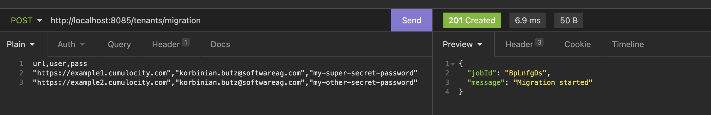
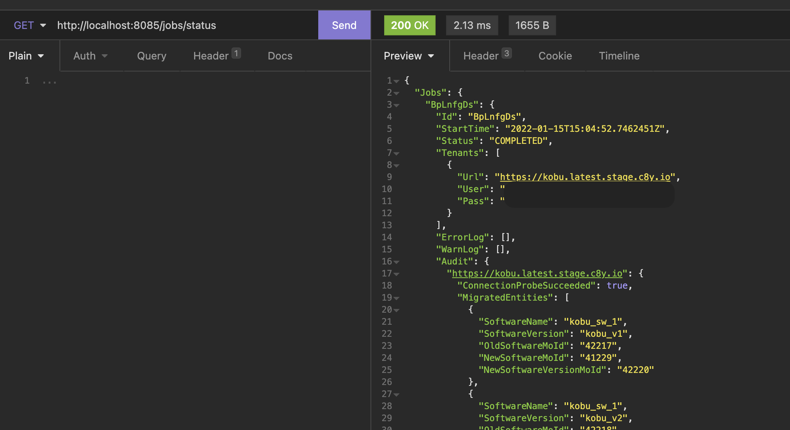
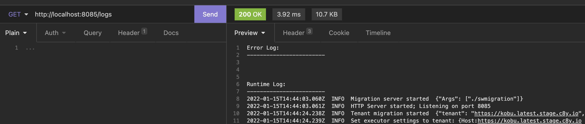
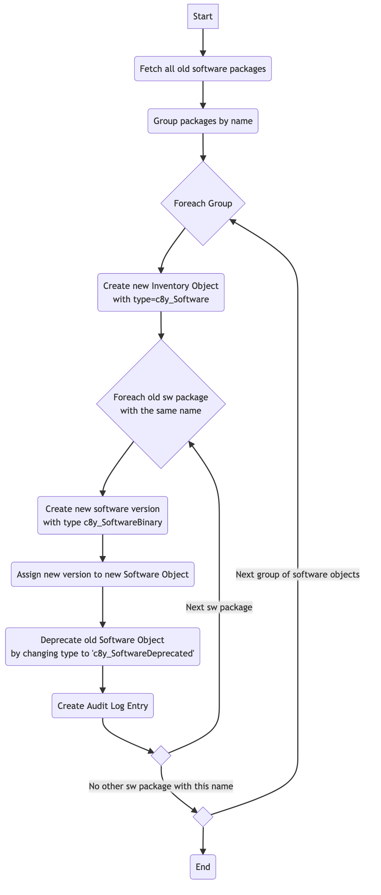

# About

Tool to migrate the software repository entries prior to Cumulocity v10.7 to the new Software Repository package model including Software Versions. The tool supports the migration of single tenants and a bulk migration of multiple tenants at once.

# Usage

1) Clone the git repositoy to your localhost: `git clone https://github.com/ButKor/c8y-swmigration.git`

2) Jump into cloned project: `cd c8y-swmigration`

3) Build the docker image: `docker build -t swmigration .`

4) Run container: `docker run --publish 8085:8085 swmigration` . In case you want the log files be persisted, `/var/log` should be mounted to your localhost.

5) Start migration via a POST request to:

```
Endpoint: https://localhost:8085/tenants/migration
HTTP Method: POST

Body Type: text/plain
Content (sample):

url,user,pass
"https://example1.cumulocity.com","korbinian.butz@softwareag.com","my-super-secret-password"
"https://example2.cumulocity.com","korbinian.butz@softwareag.com","my-other-secret-password"
```



6) Use below Endpoint to monitor the job execution: `GET https://localhost:8085/jobs/status`



Notes:

* Above endpoint shows the output for all migration jobs started since the container is running, they will be forgotten once it is restarted

* The "status" field indicates the job success, if everything went well it is "COMPLETED", in case of issues "COMPLETED_WITH_ERRORS"

* The error- and warnlog describes all issues across all provided tenants

* The audit field tells

    * which software entities were actually migrated for each tenant

    * which software entities were found but not migrated (e.g. as they are already in the new model)


7) Optionally, an endpoint to fetch Logs is available: `GET https://localhost:8085/logs`, it will respond with error- and runtimelogs as plain text.



In case of issues, feel free to reach out.


# App Logic

Essentially the script does:

1. Fetch all old software objects (once a software object has no childAdditions, it is considered as being the old domain model)
2. Group these softare objects by name
3. For each of these groups:
3.1 Create a (new) single software entry with the given software name
3.2 Create a new software version for each 'old' software object with the same name
3.3 Assign the software version to the software package created in 3.1
3.4 "Burry" the old software object by changing its type to c8y_SoftwareDeprecated and adding a migration note to the Inventory Object
3.5 Log action in platforms audit log

Below activity diagram shall illustrate the process:




# Rollback

The existing Software Objects are not deleted but only burried by changing it's types. Thus, a rollback is possible at any time. To do so, two things need to be done:

* The newly created Software Repository entries shall be deleted (either manually or via script)

* Do the following call to each object of type c8y_SoftwareDeprecated (either manually or via script):

Fetch all deprecated inventory objects 
```json5
GET https://kobu.latest.stage.c8y.io/inventory/managedObjects?type=c8y_SoftwareDeprecated
```

For each of them:
```json5
PUT /inventory/<<mangedObjectId>>
{
    "type": "c8y_Software",
    "status": null,
    "note": null,
}
```
